# Security Model

Gate0 is a micro-policy engine. This document defines what it defends against, what it explicitly does not defend against, and the mechanical invariants it guarantees.

---

## Threat Model

### What Gate0 Defends Against

| Threat | Defense |
|--------|---------|
| **Logic bugs in authorization** | Explicit deny-overrides semantics, ordered evaluation, no implicit defaults |
| **Ambiguous rule evaluation** | Deterministic rule ordering, first-match-wins within effect class |
| **DoS via unbounded input** | Hard limits on rules, condition depth, and context size |
| **Silent failure modes** | All operations return `Result`, no panics in core logic |
| **Inconsistent decisions** | Same input always produces same output, no randomness |

### What Gate0 Does NOT Defend Against

| Non-Goal | Rationale |
|----------|-----------|
| **Malicious policy author** | Caller is trusted to construct valid policies. Gate0 enforces bounds, not intent. |
| **Side-channel attacks** | No countermeasures for timing, cache, or power analysis. |
| **Timing attacks** | Evaluation time varies with input. Not constant-time. |
| **Compromised host** | If the runtime is compromised, all bets are off. |
| **Incorrect upstream identity** | Gate0 trusts the `principal` field as provided. Identity verification is out of scope. |
| **Policy correctness** | Gate0 evaluates policies as written. It cannot detect semantic errors in policy logic. |

### Assumed Attacker Capabilities

| Capability | Assumed |
|------------|---------|
| Full control over request input | ✓ Yes |
| Ability to craft worst-case conditions | ✓ Yes |
| Ability to trigger repeated evaluations | ✓ Yes |
| Control over policy construction | ✗ No |
| Access to host memory or process | ✗ No |

---

#### Security Architecture

Gate0 implements a three-stage defense pipeline to ensure that hostile input is caught before it can cause CPU or memory exhaustion.

```mermaid
flowchart LR
    subgraph Construction ["Stage 1: Construction (Static)"]
        direction TB
        C1[Check Rule Count]
        C2[Validate Matcher Limits]
        C3[Check Condition Depth]
        C4[Validate String Lengths]
    end

    subgraph Evaluation ["Stage 2: Evaluation (Dynamic)"]
        direction TB
        E1[Validate Request Strings]
        E2[Validate Context Size]
        E3[Stack-Safe Traversal]
        E4[Constant-Memory Logic]
    end

    subgraph Cleanup ["Stage 3: Cleanup"]
        direction TB
        L1[Stack-Safe Drop]
    end

    INPUT([Untrusted Input]) --> Construction
    Construction --> POLICY[(Bounded Policy)]
    POLICY --> Evaluation
    Evaluation --> DECISION([Safe Decision])
    DECISION --> Cleanup
```



### Invariants

Gate0 maintains several core invariants to remain defensible:

1.  **Termination**: All evaluation logic is non-recursive and stack-based. Depth is checked at construction.
2.  **Determinism**: Policy results are stable across identical requests and restarts.
3.  **Memory Safety**: Zero use of `unsafe` in core library; zero leaks in evaluation paths.
4.  **Resource Bounds**:
    *   **Rule Count**: Maximum rules per policy ($R$)
    *   **Condition Depth**: Maximum nesting in conditions ($D$)
    *   **Context Size**: Maximum attributes in request context ($C$)
    *   **Matcher Options**: Maximum items in `OneOf` lists ($M$)
    *   **String Length**: Maximum length of any identifier or value ($L$)
5.  **Fail-Closed**: By default, any unmatched request or evaluation error returns `Deny`.

### Mechanical Proofs

- **No Recursion**: Both validation and evaluation are implemented using manual stacks.
- **Panic-Free**: All operations return `Result`.
- **Pre-allocation**: Evaluation stacks are pre-allocated based on known depth bounds.
- **Safe Destruction**: Manual, stack-based `Drop` implementation for `Condition` prevents overflows during cleanup.
- All operations are fallible and return explicit errors

### Bounds Enforcement

| Bound | Default | Enforced At |
|-------|---------|-------------|
| Max rules | 1000 | Policy construction |
| Max condition depth | 10 | Policy construction |
| Max context attributes | 64 | Evaluation time |

### Conflict Resolution

- Deny always overrides Allow (deny-overrides semantics)
- Within same effect class, first matching rule's reason is returned
- No matching rules = Deny with reason `NO_MATCHING_RULE`

---

## Verification

### Automated Testing

- **Unit tests**: Every module has isolated tests for individual functions
- **Integration tests**: Realistic policy scenarios in `lib.rs`
- **Property-based tests**: Random input generation via `proptest`
- **Worst-case tests**: Maximum bounds exercised in test suite

### Property-Based Testing Bounds

Property-based testing is intentionally bounded to prevent resource exhaustion during local runs:

| Parameter | Value | Rationale |
|-----------|-------|-----------|
| Test cases | 25 | Sufficient for adversarial coverage without memory pressure |
| Max condition depth | 5 | Stresses recursion without exponential explosion |
| Max rules per test | 20 | Exercises policy limits without allocation storms |
| Timeout per case | 10s | Generous for any single evaluation |

These bounds prove adversarial intent, not exhaustiveness. CI runs can increase
`PROPTEST_CASES` for deeper coverage on machines with more resources.

### Panic-Free Verification

Core logic is searched for:
- `.unwrap()` — none
- `.expect()` — none  
- `panic!` — none

### Undefined Behavior Check

MIRI validates the library crate for undefined behavior:

```bash
cargo +nightly miri test --lib
```

Validates:
- No undefined behavior
- No invalid memory access
- Lifetime soundness
- No use-after-free or double-free

> **Note**: Property tests (`--test properties`) cannot run under MIRI due to 
> proptest's filesystem requirements for regression persistence. This is a 
> proptest limitation, not a Gate0 limitation. The library tests provide full 
> coverage of core logic.

---

## Out of Scope

The following are explicitly not part of Gate0's security model:

- Cryptographic operations
- Network communication
- Persistence or caching
- Audit logging (caller responsibility)
- Policy serialization/deserialization

Gate0 is a pure function: `(Policy, Request) → Result<Decision, Error>`

Everything else is the caller's responsibility.
